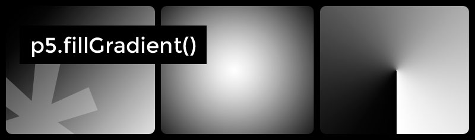

# p5.fillGradient

> Fill shapes in [p5.js](http://p5js.org/) with **Linear, Radial and Conic Gradients**.
**p5.fillGradient** enables shape filling with Linear, Radial and Conic Gradients instead of plain colours in your [p5.js](http://p5js.org/) sketch.

## Install

Download the script and add it to your web document along with the p5.js library.

```html
<script src="https://cdnjs.cloudflare.com/ajax/libs/p5.js/1.4.1/p5.min.js"></script>
<script src="./path/to/p5.fillGradient.min.js"></script>
```

They are both available on NPM:

```html
<script src="https://unpkg.com/p5"></script>
<script src="https://unpkg.com/p5.fillgradient"></script>
```

## Usage

**p5.fillGradient** exposes the `fillGradient()` function into your p5js sketch and sets the current fill style with the parameters defined by the user once it is called.

### `fillGradient(type, properties, context)`

#### &mdash; `type`

`String` with one of these values: *linear*, *radial* or *conic*. It defaults to *linear*. Be aware that browser support for *conic* gradients is still poor and not fully adopted by all major browsers. More info &rarr; [Can I use? CanvasRenderingContext2D API: createConicGradient](https://caniuse.com/mdn-api_canvasrenderingcontext2d_createconicgradient)

```js
// i.e:
fillGradient('linear',...
```

#### &mdash; `properties`

`Object` (Optional) with the following keys:

* **`from`** : *`Array [x, y, (radius | angle)]`*. Starting x and y point absolute coordinates. Radial and Conic gradients add a third value, `radius` / `angle` (expressed in degrees) respectively.
* **`to`** : *`Array [x, y, (radius)]`*. Ending x and y point coordinates.
* **`steps`** : *`Array`*. Each array item is either an *`Array [p5Color Object, stopAt]`* or a *`p5Color Object`* that will distribute stopping steps equally

```js
// i.e:
('linear', {
    'from' : [20, 20], // starting point [x, y] coords
    'to' : [580, 580], // ending point [x, y] coords
    'steps' : [
        [ color(255), 0 ], // p5Color Object, stopAt (0-1)
        [ color(0, 96, 164), .25 ],
        [ color(0, 128, 196), .75 ],
        [ color(0), 1 ]
    ]
})
```

#### &mdash; `context`

`Object (drawingContext)` (Optional)


## Examples:

### Linear Gradient

```js
fillGradient('linear', {
    from : [0, 0],   // x, y : Coordinates
    to : [400, 400], // x, y : Coordinates
    steps : [
        color(255),
        color(0, 96, 164),
        color(0)
    ] // Array of p5.color objects or arrays containing [p5.color Object, Color Stop (0 to 1)]
});
```

### Radial Gradient

```js
fillGradient('radial', {
    from : [200, 200, 0], // x, y, radius
    to : [200, 200, 200], // x, y, radius
    steps : [
        color(255),
        color(0, 96, 164),
        color(0)
    ] // Array of p5.color objects or arrays containing [p5.color Object, Color Stop (0 to 1)]
});
```

### Conic Gradient

```js
fillGradient('conic', {
    from : [200, 200, 0], // x, y, angle(degrees)
    steps : [
        color(255),
        color(0, 96, 164),
        color(0)
    ] // Array of p5.color objects or arrays containing [p5.color Object, Color Stop (0 to 1)]
});
```


---

&mdash; [@alterebro](https://twitter.com/alterebro)


<!--
```json
{
    "name" : "p5.fillGradient",
    "desc" : {
        "en" : "p5.fillGradient allows you to fill shapes with Linear, Radial and Conic Gradients instead of plain colours",
        "es" : "p5.fillGradient permite rellenar formas con degradados lineales, radiales y cónicos en vez de con colores planos"
    },
    "url" : "https://github.com/alterebro/p5.fillGradient",
    "author" : {
        "name" : "Jorge Moreno",
        "url" : "https://alterebro.com",
        "twitter" : "@alterebro",
        "instagram" : "alterebro"
    },
    "misc" : [
        "p5.fillGradient enables p5.js to fill shapes with Linear, Radial and Conic Gradients",
        "Fill shapes in p5.js with Linear, Radial and Conic Gradients"
    ]
}
```
-->
